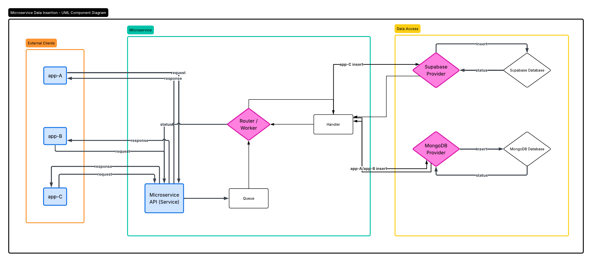
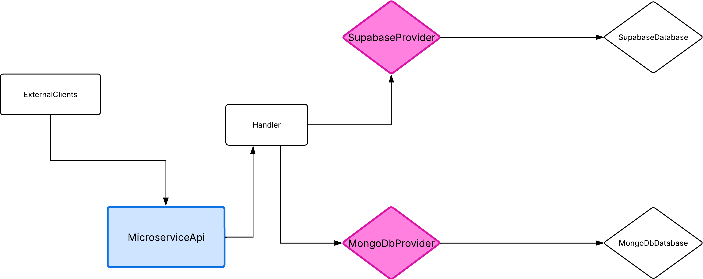

Add Data Microservice

# About

This is a microservice using Express and ZeroMQ to allow users to send requests to insert records
into predetermined databases. Currently supports MongoDB and Supabase, and limited table insertions
for each. The app currently supports up to 3 unique applications, and includes extensibility to increase
to many more. Each application also can insert unique information using the 'resourceType' field.

This microservice was written using documentation from Express and ZeroMQ with the assistance of CoPilot
to integrate workflow for message queueing.

# How to install & run Add-Data

This application has 2 separate executables, one for the server and the other for the worker. The 'worker' is an instance of ZeroMQ
that listens to messages and then does something with them, in this cases uses a message queue to send requests to an outside
server. You will need to run them independently.

Installing the application:

```
npm install
```

Running the server:

```
npm run dev
```

Running the worker:

```
npm run worker
```

The server binds to port 3000, and uses port 3001 to send messages and 3002 to receive. The worker listens for messages on 3001 and 3002.

# How to REQUEST & RECEIVE data from Add Data

The request made to Add Data will trigger an insert operation in the requested database, and the returned
data is a confirmation that the data was inserted.

Requesting:

To request an insert, simply complete a POST to the specified address. Using the format:

```
curl -X POST http://localhost:3000/add \
 -H "Content-Type: application/json" \
 -H "x-api-key: TEST-KEY-ABC123" \
 -d '{
"appId": identifier,
"resourceType": resource indicator,
"data": {
formated object containing the data to insert
}
}'
```

appId - this is the ID of your application, it's configured for the microservice
resourceType - this is the type of resource you want to insert, you can configure as many as you like
data - this is your insert object, they are pre-defined in the application so you can validate the data

In order to have a successful insertion, you will need to configure the insert schema and handler so that
it works with the data you wish to insert into your database. You will also need to configure the databse
credentials in the secrets so that you can complete the insertion process.

Receiving:

Upon a successful insertion operation, the microservice sends back a confirmation notifying the user
that there was a successful insertion operation.

# Request Format

Here is an example POST request to add a new location to Application C

```
curl -X POST http://localhost:3000/add \
 -H "Content-Type: application/json" \
 -H "x-api-key: TEST-KEY-ABC123" \
 -d '{
"appId": "app-C",
"resourceType": "location",
"data": {
"name": "OSU Campus",
"street_address": "1500 SW Jefferson Way",
"city": "Corvallis",
"state": "OR",
"zip": "97331",
"phone": "555-123-4567",
"email": "info@osu.edu"
}
}'
```

# UML Diagram

See file 'Add Data UML.png' in the code base.


